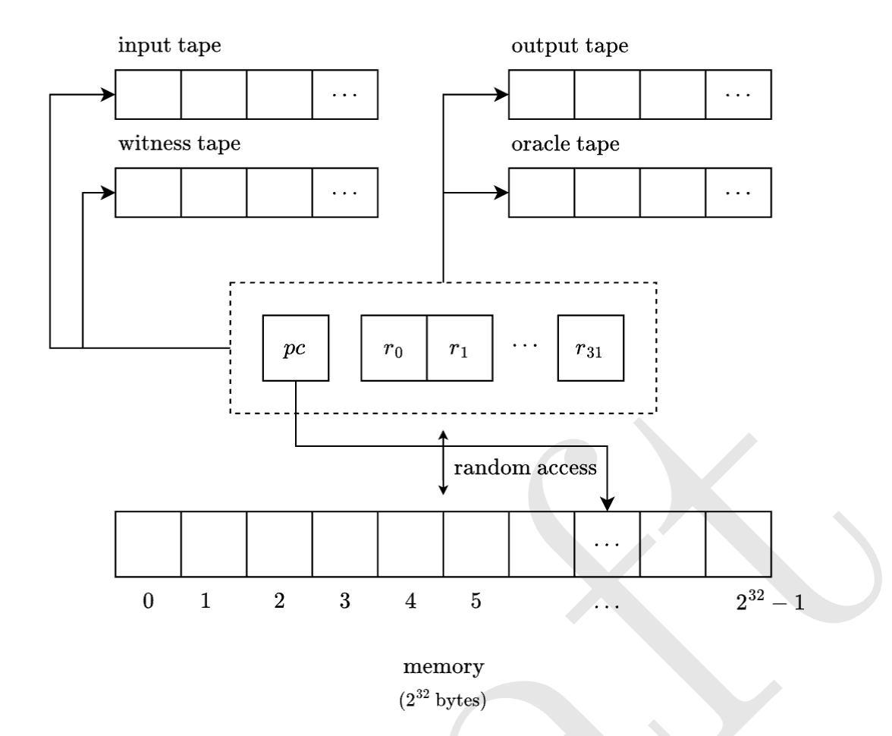
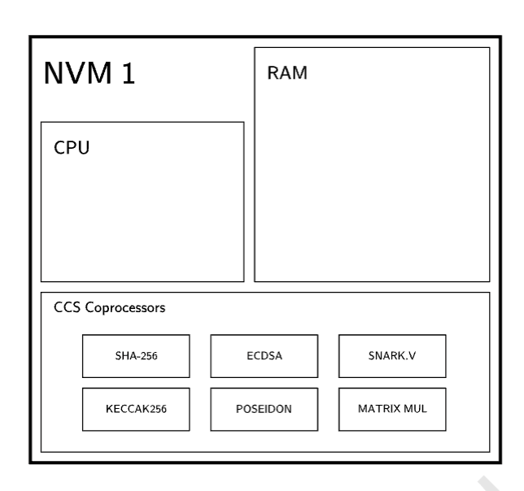
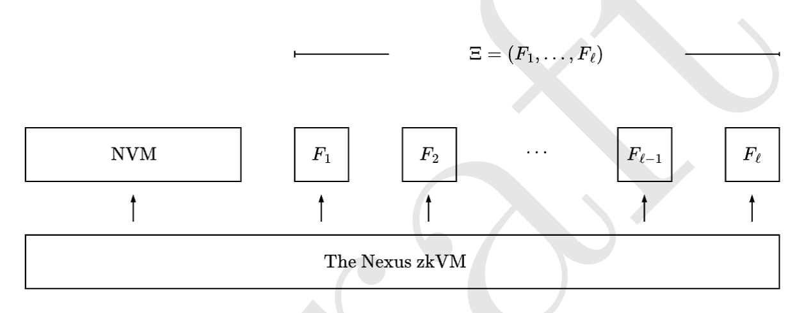
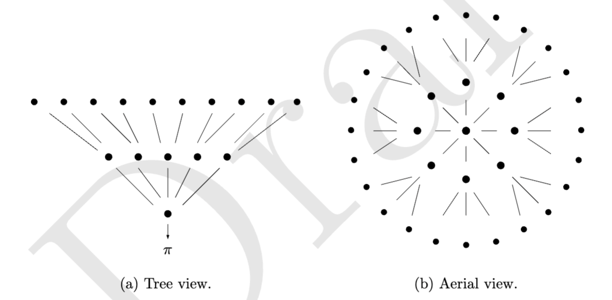

# Nexus 中文白皮书

翻译者 Brian Seong

## Abstract

我们介绍 Nexus 项目，这是一个旨在实现可验证计算的互联网规模的努力。自图灵在 1936 年引入通用计算机的概念——一种假想的机器，能够执行任何计算以来，世界已经取得了巨大的进步。这一概念被认为是通用计算机的起源，并被冯·诺伊曼用来介绍冯·诺伊曼架构——通用图灵机的物理实例化。现在，这种架构几乎支持着所有现代计算机的运行。

在本文中，我们介绍了 Nexus zkVM（零知识虚拟机），这是一种能够证明任何计算的机器。也就是说，该机器可以为任何状态机（例如 RISC-V、EVM、Wasm）及其特定指令集，生成简洁的零知识证明，证明程序执行是正确的。Nexus zkVM 专注于证明大型计算（例如超过 10 亿 CPU 周期）并且被设计为支持大规模并行增量证明生成，非常适合在分布式证明网络中并行证明。

zkVM 由现代高速递归证明系统（即folding/accumulation）支持，这些系统允许将证明组合并聚合，实现了增量可验证计算（IVC）及其概念上的泛化——携带证明的数据（Proof Carrying Data - PCD）。此外，我们引入了 Nexus 虚拟机（NVM），这是一个简单、最小且可扩展的通用图灵机：一种专为最大化验证者性能而设计的虚拟 CPU 架构。NVM 是 Nexus zkVM 的核心计算模型，可以以最小的开销，编译和仿真技术以及指令集扩展（例如 SHA-256）来模拟任何其他 ISA（如 RISC-V、EVM、Wasm 等）。

我们简要描述了即将推出的 Nexus 网络，这是一个大规模分布式验证者网络，它聚合了一组异构计算机的集体 CPU/GPU 力量，以实例化一个极度并行化的大规模证明生成系统，为 Nexus zkVM 提供服务。这使得 zkVM 能够以与网络集体计算能力成正比的规模（以每秒验证的 CPU 周期数衡量）运行。

从根本上说，Nexus 项目旨在通过各种科学、工程和经济技术将可验证计算的具体成本降低数个数量级，使其最终成为一种实用的计算形式。该项目建立在几十年的科学研究基础之上，包括密码学、复杂性理论、编译器和高性能计算等领域。我们专注于提供简单的开发者体验和一个旨在支持生产级应用的系统设计，初始支持 Rust 程序。

我们设想了一个互联网的未来，其中计算和数据的完整性由证明保护：一个通过数学真理增强人类合作的未来。这构成了我们迈向这一愿景的第一步建设。

## 1 Summary
在这份白皮书中，我们描述了 Nexus 项目的愿景以及我们的第一套技术。有关正式处理和新技术，请参阅我们的后续技术论文。

简而言之：Nexus 正在构建一个分布式 zkVM，旨在**每秒证明一万亿 CPU 周期**。

我们相信，世界上的计算机可以联合成为一个单一的可验证超级计算机，并共同证明人类的计算。

如何阅读。本文档的技术细节程度逐渐增加。

- 对于普通读者：我们建议阅读摘要（第1节）以了解：
  1. Nexus zkVM（第1.1节）
  2. Nexus 虚拟机（第1.2节和1.3节）
  3. Nexus 网络（第1.4节）

- 对于开发者：我们建议查看示例（第1.6节）和开源实现（第1.5节）以及官方 Nexus 文档 https://docs.nexus.xyz。

- 对于高级读者和密码学家：我们建议阅读引言（第2节）和历史背景（第3节）。要深入了解 Nexus zkVM，我们建议从第4节开始阅读。

有关问题、反馈或参与，请通过 hello@nexus.xyz 与我们联系。

### 1.1 Nexus zkVM

Nexus zkVM，这是一种能够证明任何计算的机器。我们的实现是完全开源的。zkVM 专注于证明非常大的计算量（例如，超过10亿+ CPU 周期）。它通过极端并行化实现这一目标：zkVM 实现了轻量级和无限制的增量可验证计算（IVC）[Val08]，这是一种允许通过使用现代高速递归零知识证明系统（即Folding/Accumulation Schemes）[KST22;KS22;KS23b;KS23a;BC23] 来增量计算和更新正确计算的证明的原语。这些技术使得证明可以高速累积（参见图1），并且完全不使用 SNARKs。


图1：一个深度为 η 的 r-元证明累积树，不使用 SNARKs。

证明累积（不使用 SNARKs），见图1，是一种新颖的技术，允许将证明组合并聚合，这本身就允许在大规模的不受信任计算机网络中高效执行证明生成。通过这种方式，zkVM 有效地实现了携带证明的数据（PCD）[CT10]的概念，这是 IVC 在分布式设置中的泛化，其中证明计算由分布式证明者网络执行。然而，通过无 SNARK 递归实现高速 IVC 的代价是大型证明。为了解决这个问题，我们通过一系列的 SNARKs 递归来压缩最终累积的证明。

**执行序列**。 Nexus zkVM 的执行序列分为三个阶段，另外还有一次性的设置阶段。参见图2，了解视觉表示。


图 2：Nexus zkVM 执行序列。此处，F 表示 Nexus 虚拟机上的一个 CPU 周期。第二步（IVC / PCD）是大规模并行化分布式的无 SNARK 增量证明生成，在椭圆曲线的二元环[TG14;NBS23;KS23a]中出于技术原因发生。

**一次性设置**。可选地指定一个自定义机器架构 $\Xi$ = [F1 ... Fℓ] 作为 ℓ 个附加 CPU 指令的列表，并为系统生成公共参数。这只需要为给定的机器架构执行一次。

机器 $\Xi$ 可以是空列表 $\Xi$ = []（即，在 NVM 上的默认执行，见第1.2节），也可以是一个单一电路 $\Xi$ = [F1]（例如，BLS 签名聚合[BLS01]），可以是一个完整的机器架构（例如，EVM [Woo+14], 可以是RISC-V [WLPA14], Wasm [Haa+17]），或一系列自定义用户定义的指令（例如，SHA-256, ECDSA 签名），都可以用来扩展 NVM。

我们将这些扩展称为 zkVM 协处理器，请参见第1.3节。

然后，对于每个为机器 $\Xi$ 编码的程序 $\Psi$，我们执行以下步骤：

- **编译**: 将程序编译成 Nexus 虚拟机（NVM）指令集。NVM 将在机器 $\Xi$ 上执行程序 $\Psi$

- **执行**: 在 NVM 上执行程序，生成完整的执行踪迹记录。

- **折叠**: 以高度并行化的方式产生和累积 IVC 证明 $\pi_i$，为执行块。这一步骤是证明过程的核心，也是计算上最为密集的部分。然而，它极度可并行化，并且可以由分布式证明者网络完成。

每一步折叠都需要计算单个多标量乘法（MSM）。这也是递归证明组成中最低的验证者开销[KS23b]。此外，MSM 本身就高度可并行化，这已被行业努力[Aas+22]所深入研究。

- 压缩。最后，用一系列（zk）-SNARKs 压缩累积的证明。

### 1.2 Nexus 虚拟机

Nexus 虚拟机（NVM）是一个简单、最小且可扩展的指令集架构（ISA）和随机存取机（RAM），具有冯·诺依曼架构，使其能够执行通用计算。也就是说，它是一个通用图灵机。NVM 受 vnTinyRAM[CGTV20] 和 RISC-V[WLPA14] ISA 的启发，但不同于后者，它是专为最大化验证者性能而设计的。

NVM 具有以下特点：

- **一个简单的 CPU 架构**：一个简单的 32 位指令集，有 40 条指令和简化的指令解码。

- **一个简单的内存模型**：一个具有单一堆栈和堆的简单 32 位地址空间，通过 Merkle 树[Mer87]和 Poseidon 哈希[Gra+21]以增量方式进行验证。

- **一个简单的 I/O 模型**：一个简单的 32 位输入/输出模型，带有公开输入（$x$）、私有输入（$w$）和公开输出（$y$）的单磁带。给定程序 $\Psi$，NVM 根据 ISA 执行其指令，在公开和私有输入上运行，并记录结果输出。

- **可扩展性**：NVM 可以通过我们称为 zkVM 协处理器的自定义指令进行扩展。这些自定义指令是用 CCS 电路[STW23a]编写的，CCS是R1CS[GGPR13]，Plonkish[GWC19;CBBZ23]和AIR[BBHR19;Sta21;BCKL22]的泛化版本。这些电路扩展了 NVM 指令集，并可以用来加速自定义指令而不影响每周期的验证者性能。因此，Nexus 协处理器在概念上类似于 EVM 预编译指令[Woo+14]。

Nexus zkVM 可以视为 NVM（计算模型）和证明系统（验证者）的结合体。zkVM 运行 NVM 并产生完全相同的输出。此外，它还构建了一个证明正确计算的简洁证明。也就是说，zkVM 在零知识中证明了一个私有见证 $w$ 的知识，以便 $\Psi (x, w) = y$。请注意，由于压缩步骤结束时的 zk-SNARK（见图 2），Nexus zkVM 实际上是零知识的（也就是说，不仅是简洁的），并且假设验证者没有泄露信息，它隐藏了可选的私有见证 $w$。


图3: Nexus 虚拟机

### 1.3 Nexus zkVM 协处理器

zkVM 协处理器的概念受到[KS22]启发并且非常强大。从理论上讲，任何程序都可以作为 CPU 指令序列的一部分被证明，但在这个模型中证明许多类型的简单程序在实践中是不可行的。例如，即使是在虚拟机模型中证明单个 SHA-256 哈希，也需要证明大约 64000 个 CPU 周期，这些周期是在软件中模拟 SHA-256 函数。相比之下，直接证明一个手动编写的 SHA-256 哈希电路（类似于 ASIC）大约只涉及 30k 个约束，需要的计算量大约少 1000 倍。这就是抽象化的代价。

在传统的 zkVM 设计中（例如，vnTinyRAM[CGTV20]），人们使用通用电路来模拟整个 CPU。在 CPU 中添加新指令涉及增加每一步证明的总约束数量，所以自然的策略是最小化被证明的 CPU 的大小。

为了打破这种 CPU 与 ASIC 的困境，Nexus zkVM 引入了 zkVM 协处理器的概念，当被主程序执行时，只有在执行特定的协处理器时，验证者才需要支付扩展 NVM 指令集的证明成本。这允许 Nexus zkVM 保持对开发者友好的 CPU 抽象和一个小型的图灵完备 ISA，同时允许在指令集上进行类似 ASIC 的扩展（见图 5），而只有在实际执行这些指令时才需要支付这些指令的成本。由于最近在非单一 IVC 和相关折叠/累积技术方面的进步[KS22;BC23;ZGGX23;AST23;GHK23]，这些技术成为可能。

特别是，zkVM 协处理器允许 zkVM 加速自定义密码原语（例如，SHA-256、ECDSA 签名）、高级操作（例如，矩阵乘法、计算平方根等）甚至通过将其他 SNARK 的验证器电路作为自定义指令注入 zkVM，从而递归地组合其他 SNARK。缺点是这些自定义用途的电路需要手动实现，但它们只需要实现一次。

**简洁性与普遍性**。除了为验证者性能优化之外，NVM 还试图回答一个社会性问题：我们能否设计一个足够简单的通用计算模型（即通用图灵机的具体实例），使得在 NVM 上的计算证明能够普遍令人信服？

例如，考虑通过在 x86 机器（具有 $2^{120}$ 个潜在指令和大型架构复杂性）上仿真得到证明 $\pi_1$，与在一个只有基本 ADD、SUB、XOR 等指令的 32 指令机器上仿真得到的证明 $\pi_2$，哪一个证明 $\pi_1$ 或 $\pi_2$ 更令人信服作为 $Fib(n)$ 计算的真实证明？哪一个证明 $\pi_1$ 或 $\pi_2$ 在未来 10 年的某个时间点可能更令人信服？哪一个验证器电路可能更容易实现和审计？


图4: Nexus虚拟机（NVM）的指令集架构（ISA）


图5: Nexus 虚拟机 zkVM 协处理器的设计，旨在允许 NVM 指令集上的加速指令获得类似 ASIC 的性能。

### 1.4 Nexus 网络

Nexus 项目致力于在互联网规模上实现可验证计算。为此，我们提出了一个系统，该系统将能够把 Nexus zkVM 的总吞吐量提高数个数量级。我们将这个系统称为 Nexus 网络，这是一个汇集了异构计算机网络的集体 CPU / GPU 力量，以实例化一个极度并行化的大规模证明生成系统，为 Nexus zkVM 提供服务。这允许 zkVM 以与网络集体计算能力成比例的规模（以每秒 CPU 证明的周期数衡量）运行。

**分布式超级计算机**。在互联网上的大规模志愿者计算在一些著名项目中取得了巨大成功。这些项目利用了数百万志愿者的集体计算能力，解决了大规模的科学问题，这些系统的总计算能力以每秒浮点运算次数（FLOPS）来衡量。例如：

- 1996年的大互联网梅森素数搜索（GIMPS）[96]，在2004年初达到了14 teraFLOPS的速度。
- 1999年的SETI@Home[And+02]来自NASA，该项目在2008年获得了吉尼斯世界记录，作为历史上最大的计算，达到了668 teraFLOPS。
- 2000年的Folding@Home[Beb+09]来自斯坦福大学，达到了2.43 exaFLOPS，成为第一个 exaFLOP 计算系统。

Nexus 网络试图做同样的事情，但针对的是可验证计算的问题。因此，Nexus 网络可以被看作是一个分布式的可验证超级计算机，它允许 zkVM 根据网络的集体计算能力按比例扩展其吞吐量。


图 6：Nexus 网络。证明在类似树的方式中进行聚合。

**在分布式计算中的可验证性**。上述提到的项目依赖于各种启发式方法来确保分布式计算的完整性。例如，SETI@Home 依靠在多个节点之间复制计算，然后比较结果。如果出现分歧，计算将由另一组随机选择的志愿者重复。这最多只能提供关于计算完整性的概率保证。

相比之下，Nexus 网络提供了关于分布式计算完整性的可证明保证，因为输出本身就是一个证明。请注意，这不仅适用于最终证明，也适用于增量可验证计算中的所有中间证明。因为第一次实例化基于 Nexus 网络的高速递归证明聚合技术的 Proof-Carrying Data 系统，在实际中成为可能。

**一个可验证的超级计算机**: 因此，我们提出了一个大胆的问题：

我们能否能将世界上的计算机联合成一个单一的可验证超级计算机？

特别是，我们认为如果有足够的计算能力，Nexus zkVM 可能会达到每秒数万亿 CPU 周期，从而能够证明目前所能实现的计算量级大得多的计算。Nexus 网络是朝向这一愿景的第一步。

**实际问题**: Nexus zkVM 将证明过程分成可以任意小的计算块，然后逐步累积证明。由于这一点，Nexus 证明者可以在只有 1GB RAM 的情况下运行。这使得即使是像智能手机和笔记本电脑这样的小型设备也能参与到网络中并提供有用的计算资源。在实践中，我们预计强大的证明者将主导系统中的计算供应，因为优化用于计算多标量乘法（MSMs）的 GPU、FPGA 或 ASIC 集群，其计算能力要强大得多。

### 1.5 开源实现

那么，到底实现了什么？Nexus zkVM 和 Nexus 网络都是完全开源的，并且都是用 Rust 实现的。这些包括：

1. **证明累积**: Nova、CycleFold 和 HyperNova。继 Microsoft Research 在2022年发布原始开源实现 Nova[KST22]之后，我们提供了第一个从零开始构建的 Nova 和后续证明累积系统的生产级实现，所有这些都在 arkworks[ark22]构建：

   - Nova 折叠方案[KST22]
   - CycleFold 多折叠方案[KS23a]
   - Nova + CycleFold IVC 证明系统（参见第5.4节）
   - 二叉树并行化的 Nova 方案（参见第5.6节）
   - 正在进行中的 CCS[STW23a]和 HyperNova[KS23b]的第一个实现

   我们希望这些对社区和其他项目同样有用。我们正在使用新技术[BC23;ZZD23;ZGGX23]积极改进这些。我们的实现具体展示了 Nova 与 CycleFold 的 50k 递归开销（以约束数量衡量），以及带有 CycleFold 的并行 Nova 的 200k 递归开销。我们将在后续技术论文中报告 HyperNova 的测量结果。

2. **Nexus zkVM**: Nexus zkVM 和所有执行序列步骤的实现：生成、编译（见证提取）、执行、折叠和证明压缩。参见图2。

   使用 Nexus zkVM 对任何 Rust 程序，如示例1，进行证明就像执行以下操作一样简单：

   ```bash
   $ cargo nexus prove → $ cargo nexus verify
   ```

3. **Nexus 虚拟机**。NVM 和其算术化版本在 R1CS 的实现，以及用于内存检查的 Merkle 证明，还有一个 RISC-V 到 NVM 的编译器。

   NVM 的算术化，尽管还相当原始，仍然是每个 CPU 周期大小为 30k 的电路。这是一个大型电路（主要是由于内存检查），但我们预期即将到来的改进的内存检查技术将使机器大小减少10倍，而更大的数量级改进将来自于使用 zkVM 协处理器[KS22;ZGGX23;GHK23]和查找参数[STW23b;AST23]。

   普通用户不必担心这个中间优化步骤，但它会从编译器优化带来显著的性能提升，并由于机器的简单性而更加安全。

4. **Nexus 网络**。Nexus 网络的开源实现，包括三种不同类型的节点：

   - **Nexus MSM Prover**，一个可以在至少有 1GB RAM 的任何机器上运行的证明者节点。这些节点通过按需计算 MSMs 为网络提供计算资源。向系统提供计算资源就像执行以下操作一样简单：

      ```bash
      $ cargo nexus compute
      ```

   - **Nexus PCD Prover**，一个可以在任何机器上运行并为网络提供计算资源的证明者节点。Nexus 团队目前在操作这些节点。

   - **Nexus Aggregator**，一个聚合证明并通过应用 Nexus zk-SNARK 压缩序列（参见图2）使用 SNARKs 压缩它们的节点。

5. **Nexus 证明压缩序列**。

   我们呈现：
   - **一个 Nova 友好的 zkSNARK**。除了 Microsoft 的实现[KST22]之外，第一个为累积友好型通用 R1CS 的 zk-SNARK 实现：一个针对提交的松散 R1CS[KST22]关系的修改版 Spartan[Set20] zk-SNARK，从原始的 Spartan[ark22]实现中为 R1CS 适应。
   - Zeromorph[KT23]多项式承诺方案的实现。

   我们进一步应用其他 SNARKs[Gro16;BGH19;BGH20]的最终层次的证明压缩，以实现 Nova 证明的以太坊可验证性，这允许 Nexus 连接到以太坊。这些细节将在技术论文中描述。

尚未实现的内容：
   - **非均匀性**。我们目前的实现是完全均匀的 IVC（见图5），但不是非均匀的。支持 CCS 扩展正在积极开发中。
   - **zkVM I/O**。当前的 Nexus zkVM 还不支持 I/O（例如，加载一个 JSON 文件）。所有输入必须在程序本身中编码。这是一个小但重要的限制，将在接下来的几周内解决。

### 1.6 示例

这是一个可在 Nexus zkVM 上证明的 Rust 程序示例。这段代码展示了如何用 Nexus 编写简单的斐波那契数列计算程序。

```rust
#![no_std]
#![no_main]

#[nexus::main]
fn fib(n: u32) -> u32 {
    match n {
        0 => 1,
        1 => 1,
        _ => fib(n - 1) + fib(n - 2),
    }
}
```

*清单 1: 可在 Nexus zkVM 上证明的 Rust 程序示例。*

## 2 Introduction

**图灵机**。在图灵（Turing）在其具有里程碑意义的1936年论文[Tur+36]中介绍了图灵机（Turing machine），这是一种计算的形式化定义。他是第一个观察到通用计算是可能的，并展示了通用图灵机（universal Turing machine）的存在，这种机器可以模拟任何其他机器的执行。同样，Kurt Gödel、Alonzo Church 和其他人在1930年代初也得到了计算的形式定义，所有这些最终都具有相同的表达能力。

**冯·诺依曼架构（von Neumann Architecture）**。通用图灵机的概念很快就导致其他科学家如冯·诺依曼（von Neumann）进行了实现。今天，几乎所有数字计算机都遵循“冯·诺依曼架构”[Von93]。Nexus VM 也遵循冯·诺依曼架构。

**经典证明**。在1956年，Gödel 给冯·诺依曼写了一封信[Göd56;Sip92]，他指出如果存在一个能够有效证明数学定理的实际机器，“它将具有最大量级的影响”。正如我们将看到的，这一概念与证明计算的概念接近。Gödel 实际上提出了我们今天所知的（仍未解决的）**P=NP**问题，它涉及确定性（超多项式时间）验证者（即类**NP**）（多项式时间）验证者（即类**P**）和证明的概念[2]。

**零知识证明**。1985年，零知识（zero-knowledge）交互证明的故事在 MIT 开始了，Goldwasser、Micali 和 Rackoff 在他们的论文[GMR19]中引入了**IP**类，这是**NP**的一个泛化，允许验证者和验证者之间的随机性和互动。这从根本上改变了证明本身的概念。他们介绍的零知识的定义考虑了除了其有效性之外不揭示任何信息的证明。他们的论文获得了第一个 Godel 奖。
自那以后，关于证明的大量研究产生了其他概念，例如 Arthur-Merlin 协议[Bab85]（同时工作）、MIPs[BGKW19;FRS88;BFL91]、PCPs[FRS88;BFLS91;AS92;Aro+92]、IOPs[BCS16]、NIZK[BFM88;BSMP91]、知识证明[SP92]、简洁论证和CS证明[Kil92;Mic94]以及（zk）-SNARKs[Mic94;Gro10;BCCT12;GGPR13]。关于零知识证明的历史和直到现在的现代技术的简要回顾，请参见第3节。Nexus项目建立在这些工作以及自零知识证明发明以来近四十年的研究基础之上。我们相信，由于最近的科学进步，真正可扩展的零知识对互联网时代来说就在地平线上。

### 2.1 为什么零知识证明还不实用？

**ASIC 方法**。当前典型的零知识证明计算方法是通过手动编写算术电路（例如，R1CS、Plonkish、AIR 等），通过像 Bellman[Zkc15]或 arkworks[ark22]这样的库，或者通过更高级的DSL（例如，Circom[ide21]、Zokrates[Zok17]、Noir[Noi20]、Leo[Chi+21]等）以及一个 DSL 到电路的编译器，然后使用 zk-SNARK 来证明电路。在 zk-SNARK 中，Groth16[Gro16] 由于其在实际中的以太坊兼容性和小巧的证明尺寸而广泛使用，其次是 Halo 和 Halo2[BGH20]。ASIC 方法概念上类似于为给定计算设计一个定制的 ASIC，然后用 zk-SNARK 验证 ASIC 的执行。

   **不足之处**。不幸的是，这种方法非常容易出错，并且需要高度的专业知识。此外，DSL 方法对程序施加了静态界限（例如，数组和循环的大小必须在编译时预先知道）[Chi+21]，不支持依赖于输入的控制流和内存访问[BCTV14]，也不允许自修改代码。这种方法也导致每个程序生成不同的电路，这需要重新部署新的验证器代码，这通常是非常不切实际的和不受欢迎的操作。

   所有这些实际上都是很大的限制：即使开发者愿意学习一个新的 DSL 或者手动编写算术电路（这是一个非常非平凡的任务），他们将发现大多数程序在这个模型中实际上是不可计算的。

**CPU 方法**。一个现代方法是通过证明计算机程序，而不是算术电路，这是通过模拟 CPU 或虚拟机（VM）来实现的，这是通过实现完整的 VM 为一个单一的通用电路。在这个模型中，通用电路的大小 N 与其指令集中的指令大小之和成正比。然后通过将许多这样的通用电路粘合在一起，直到静态运行时界限 T，并然后用 SNARK 证明 (N·T)-大小的电路。TinyRAM[CGTV20] 引入了这种方法，并已经在 Cairo zkVM[GPR21] 和其他 zkEVM 项目中用于以太坊虚拟机。

   **优点**。这种方法的优点是更好的开发者体验。为已经存在或定义良好的 ISA 编写程序要简单得多，开发者可以利用工具和编译器基础设施。此外，由于电路是通用的，因此只需要部署一次验证器（这在实践中是一个显著的优势）。此外，对给定 VM（例如 EVM）编写整个通用电路（这是一个耗时数月或数年的巨大工作，已经完成了几个项目）只需要做一次，然后任何符合指定时间界限 T 的 ISA 程序都可以被证明。

   **不足之处**。然而，CPU 方法有几个主要的缺点，主要与性能和可扩展性有关。

   1. **有界计算**。这种方法需要决定所有可能程序执行的静态运行时间界限 T。证明超过 T 个周期需要 (1) 生成新的公共参数和部署一个新的验证器，为一个新的界限 T'（同时也增加了验证者的时间和内存）[Ben+13;BCTV14] 或者 (2) 进行 SNARK 递归[BGH20;BCMS20;Bün+21;CGSY23]。

   2. **SNARK 递归的高成本**。第二种选择是将执行分为大小为 T 的块，并通过将完整的 SNARK 验证器作为电路（这在实践中非常困难）来“粘合”证明，并证明在步骤 i 的 SNARK 验证器接受了来自步骤 i - 1 的 SNARK 证明。这种方法的成本极高，众所周知是不切实际的[BCTV17;CCDW20]。在实践中，这使得像 TinyRAM、Cairo zkVM 和其他 zkEVM 项目这样的项目消耗了大量的计算资源，同时只能证明实际上很小的程序（例如，智能合约）。

   3. **模拟导致的低性能**。然而，这种方法面临严重的可扩展性问题。首先，VM 抽象导致比非 VM 抽象的电路大得多。例如，通过模拟证明一个 keccak256 哈希、验证一个 ECDSA 签名或者聚合 BLS 签名，需要证明数万或数百万个 CPU 周期，因为这些操作必须在 CPU 抽象中模拟[GPR21]。其次，证明 T 个通用电路的副本需要大量的验证机器和非常大的内存（例如，大约100GB的 RAM），这是必要的，以实现大小为 (T·N) 的见证。

   4. **实际安全性**。最后，这些技术几乎无法审计。即使一个人实现了完整的 VM 作为电路（经过数月或数年的努力），并且说还有一个完整的 SNARK 验证器作为电路（用于递归），也很难自信地确信电路实际上是正确实现的，并且没有漏洞[OWBB23;CMS23;Cog+23]。即使在电路实现中缺少单个约束也会导致完整的健全性漏洞（例如，如[NBS23]所示），并且验证器会接受无效的证明。

### 2.2 The Nexus System

Nexus 系统通过扩展性解决了上述限制：

- **The Nexus Network**。网络通过无界 SNARK-less 递归和高速证明聚合解决了问题 (1) 和 (2)。换句话说，Nexus zkVM 可以连接到 Nexus 网络并执行大规模并行的、无界计算的证明，在分布式证明网络中进行，这些网络将证明分区并增量地聚合。

- **The Nexus zkVM**。Nexus zkVM 通过 NVM 和 zkVM 协处理器的使用解决了问题 (3) 和 (4)，这些协处理器允许在 NVM 指令集上的加速指令获得类似 ASIC 的性能。这使得 Nexus zkVM 能够保持对开发者友好的 CPU 抽象和一个小的图灵完备 ISA，同时允许在指令集上进行类似 ASIC 的扩展。此外，NVM 的极端简化、可审计性和高度模块化也是一大优点。

我们希望这两个系统的结合将允许开发者专注于声明性地编写他们希望证明的内容，以任何编程语言，并在几秒钟内简单地接收一个证明。

我们相信，用户不应该需要深入了解支持 Nexus 系统的零知识研究和相关高性能工程背后的复杂（且非平凡）的安全性和性能属性，这些研究和工程已经持续了40多年。

## 3 背景

我们简要回顾了至今为止的科学进展，这些进展让我们站在了当前的时间点上。正如我们将看到的，我们似乎处于一个新形式的计算—可验证计算—变得可用于人类的时代的边缘。我们相信，在一个文明的历史中很少有新形式的计算被引入，我们很兴奋能够成为这一时刻的一部分。

Nexus 项目建立在巨人的肩膀上：伟大的科学家和数学家及其数十年的工作。有关深入讨论，请参阅 Goldreich 的出色文章[Gol93]《证明系统的分类》或 Ben-Sasson 等人的总结[BCS16]，我们的讨论基于这些。

**交互式证明（Interactive Proofs）**。Goldwasser、Micali 和 Rackoff 在 1985 年引入了交互式证明[GMR19]。在一个 k 轮的交互式证明中，一个多项式时间的验证者与一个全能的证明者交换 k 条消息，然后接受或拒绝。IP[k] 是具有 k 轮交互式证明的语言类，它通过允许验证者和证明者之间的随机性和交互来泛化 NP 类。Babai 独立引入了 Arthur-Merlin 游戏[Bab85]。AM[k] 是具有 k 轮 Arthur-Merlin 游戏的语言类。Goldwasser 和 Sipser[GS86]展示了两种模型的等价性，即 IP[k] ⊆ AM[k+2]。1992 年，Lund、Fortnow、Karloff 和 Nisan[LFKN92]引入了 sum-check (交互式证明) 协议[LFKN92]（现在是我们系统的主要支柱，见第 4.1 节和我们对[Set20;KS23b;STW23a]协议的实现），Shamir[Sha92] 在此基础上展示了 IP = PSPACE。后者是一个重大结果，表明交互式证明比先前认为的更加强大。

**多证明者交互式证明（Multi-prover interactive proofs, MIPs）**。Ben-Or、Goldwasser 和 Wigderson 在 1988 年引入了多证明者交互式证明[BGKW19]。在一个 $k$ 轮的 $p$ 证明者交互式证明中，一个多项式时间的验证者与 $p$ 个不相互通信的全能证明者互动 $k$ 次，然后接受或拒绝。MIP[p, k] 是具有 $k$ 轮 $p$ 证明者交互式证明的语言类。在[BGKW19]中，作者证明了 2 个证明者总是足够的（即 $MIP[p, k] = MIP[2, k]$）。Fortnow、Rompel 和 Sipser[FRS88]展示了 MIP$[poly(n), poly(n)] ⊆ NEXP$。两年后，Babai、Fortnow 和 Lund[BFL91]展示了 $MIP[2, 1] = NEXP$。

**可概率性检查的证明（Probabilistically checkable proofs, PCPs）**。可概率性检查的证明由[FRS88;BFLS91;AS92;Aro+92]引入。在一个可概率性检查的证明中，一个多项式时间的验证者对一个证明字符串有 oracle 访问权限；$PCP[r, q]$ 是验证者最多使用 $r$ 位随机性并查询证明的最多 $q$ 个位置的语言类。上述关于 MIP 的结果意味着 $PCP[poly(n), poly(n)] = NEXP$。后来的工作“缩小”了这个结果到 NP：Babai、Fortnow、Levin 和 Szegedy[BFLS91]展示了 $NP = PCP[O(\log n), poly(\log n)]$；Arora 和 Safra[AS92]展示了 $NP = PCP[O(\log n), O(\sqrt{\log n})]$；以及 Arora、Lund、Motwani、Sudan 和 Szegedy[Aro+92]展示了 $NP = PCP[O(\log n), O(1)]$。这最后一个被称为 PCP 定理，是复杂性理论中的一个重大结果，另一个获得了 Godel 奖的论文。

**参数系统（Argument systems）** 在密码学中，人们经常考虑参数系统，这是 IP，其中完整性从完美放宽到仅计算。这允许绕过 IP 的各种众所周知的限制[BHZ87;PS05]。Kilian[Kil92]通过使用 PCP 与 Merkle 树[Merk87]的结合，提供了第一个简洁交互式参数系统的构建。Micali[Mic94]通过在随机预言模型中应用 Fiat-Shamir 变换[FS86]，使相似的协议变得非交互式，从而获得了第一个 zk-SNARK。

**随机预言模型（The Random Oracle Model, ROM）**。随机预言模型（ROM）[BR93;CGH04;KM15]是用于研究计算受限证明者的一种理想化模型。大致而言，ROM是一种模型，在该模型中，证明者可以访问一个随机预言，这是一个对每个输入返回随机输出的函数。ROM与 Fiat-Shamir 变换[FS86]结合使用，将交互式证明编译成非交互式的，产生 NARKs（非交互式参数系统）[BCCT12]。参见第4.2节，了解 NARKs 的定义。

**zk-SNARKs** 许多工作构造了 SNARK 和 zk-SNARK 的实现[Mic94;Kil92]。在 Micali 之后，Lipmaa[DL08]构造了一个基于额外的假设的实现。Groth[Gro10]实现了第一个基于配对的 zk-SNARK。在实践中，由于其小巧的证明大小和以太坊兼容性，Groth16[Gro16]是行业中最广泛使用的 zk-SNARK，其次是 Halo 和 Halo2[BGH20]、Plonk[GWC19]、Spartan[Set20]、Marlin[Chi+20]、HyperPlonk[CBBZ23]、Bulletproofs[Bün+18]以及其他[Zah+18;MBKM19;Xie+19;AHIV17;Ben+19;ZXZS20;Gol+21;XZS22]。

**交互式 Oracle 证明（Interactive Oracle Proofs, IOPs）**。IOPs 由 Ben-Sasson、Chiesa 和 Spooner[BCS16]引入。IOP是 IP、MIP 和 PCP 的泛化，可以使用适当的承诺（Commitment）方案编译成 SNARKs。使用一元多项式承诺方案，可以将多项式-IOP 编译成 SNARKs，产生如 Sonic[MBKM19]、Marlin[Chi+20] 和 Plonk[GWC19]等协议。使用多线性多项式承诺方案，可以将多线性-IOP 编译成 SNARKs，产生如 Hyrax[Wah+18]、Libra[Xie+19] 和 Spartan[Set20]等协议。使用向量承诺方案，可以将向量-IOP 编译成 SNARKs，产生如 STARK[BBHR18b]、Aurora[Ben+19]、Virgo[ZXZS20]、Brakedown[Gol+21] 和 Orion[XZS22]等协议，通常都被称为 STARKs。虽然 STARKs 的优点是不需要受信任的设置并且在量子后时代可能安全，但它们有较大的证明尺寸（例如，数十千字节）和较长的验证时间，因此不适合递归使用。

**增量可验证计算（Incrementally Verifiable Computation, IVC）**。增量可验证计算（IVC）在 2008 年由 MIT 的 Valiant[Val08]引入。正如前文提到的，IVC 是一种设置，其中证明者执行计算并增量更新其正确性的证明。Valiant 还展示了如何通过 SNARKs 的递归组合来构造 IVC。

**携带证明的数据（Proof-Carrying Data, PCD）**。携带证明的数据（PCD）由 Chiesa 和 Tromer[CT10]首次引入，它将增量可验证计算（IVC）的概念扩展到分布式设置，允许在不信任各方之间执行分布式可验证计算。特别是，PCD 使得在有向无环图（DAG）上并行化的分布式计算证明成为可能，而在传统的 IVC 模型中，计算和证明更新是序列化的。

**来自 SNARKs 的 PCD（PCD from SNARKs）**。一种众所周知的构造 PCD / IVC 的方法是使用针对 NP 的 SNARKs。在每一步计算，证明者生成一个 SNARK，证明它已经正确地应用了一个函数 F，以及在电路里面包含了SNARK验证器来验证了上一步生成的证明。然而，众所周知，这种方法不切实际[BCTV17;CCDW20]，因为 SNARKs 递归组合会导致非常大的开销。或者，人们可以使用无信任设置的 SNARKs，但它们的验证器甚至比带有信任设置的 SNARKs 更昂贵，无论是从理论上还是实际上。如上所述，这使得对于递归使用 STARKs 不切实际。

**SNARKs 用于虚拟机和椭圆曲线循环（SNARKs for Virtual Machines and Cycles of Elliptic Curves）**。遵循 IVC 以及 Valiant 的工作中对递归 SNARKs 的理论工作[BCCT13]，Ben-Sasson、Chiesa、Tromer 和 Virza[BCTV17]引入了椭圆曲线循环的概念（这是我们广泛使用的，见 [KST22;NBS23;KS23a]，第5.4节和图2），这些循环对于使用 KZG[KZG10] 或 Pedersen[Ped91] 承诺的星星系统（STARKs）、FRI [BBHR18a] 来说是（几乎）必要的，以便进行递归组合的SNARKs。在此之后，Ben-Sasson、Chiesa、Tromer、Genkin 和 Virza 构建了 IVC 的第一个实现，用于简单的虚拟机，采用 Harvard 架构的 TinyRAM[Ben+13]。作者后来提供了一个基于冯诺依曼架构的虚拟机的 IVC 第一次实现，vnTinyRAM[BCTV14]。vnTinyRAM 启发了 Cairo zkVM 项目[GPR21]的实现，并且目前在 Starkware [Sta22] zk-rollup[LNS20]使用中。vnTinyRAM也是 Nexus zkVM 的灵感来源。

**累积（Accumulation）**。近期的一系列工作提出了批量验证 **NP** 陈述来减少构建 IVC / PCD 时证明者的开销。Bowe、Grigg 和 Hopwood 构建了 Halo[BGH19]，提出了一种递归证明构成方法，该方法替换了 SNARK 验证器，采用了更简单的累积器算法，延迟在 IVC 链的最末端进行完全验证。Bünz、Chiesa、Mishra 和 Spooner [BCM20] 正式定义了*累积方案*，展示了它们足以构建 PCD。随后，Bünz 等人[Bün+21] 展示了如何从任何满足弱类型累积的 NARK 构建 PCD。

**折叠方案（Folding Schemes）**。折叠方案由 Kothapalli、Setty 和 Tzialla 在 2022 年引入[KST22]，作为一种在不使用 SNARKs 的情况下实现 IVC 的方法，它通过直接聚合 NP 陈述的证明本身。后续的工作改进或泛化了 Nova，包括 SuperNova [KS22]、HyperNova [KS23b]、CycleFold [KS23a]、Protostar [BC23]、ProtoGalaxy [EG23]、从多折叠方案来的 PCD [ZZD23]，以及 KiloNova [ZGGX23]。折叠方案背后的基本概念是利用承诺（例如 Pedersen 承诺 [Ped91]）的同态性质来按顺序积累每个步骤的验证，将 IVC/PCD 聚集到单个实例中，因此在 IVC/PCD 链的末端延迟完全验证。