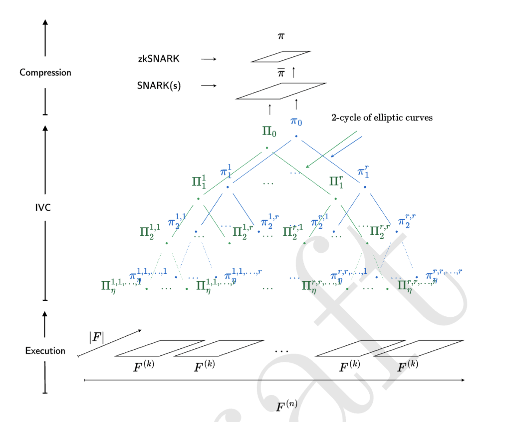

# Nexus 中文白皮书

翻译者 Brian Seong

## Abstract

我们介绍 Nexus 项目，这是一个旨在实现可验证计算的互联网规模的努力。自图灵在 1936 年引入通用计算机的概念——一种假想的机器，能够执行任何计算以来，世界已经取得了巨大的进步。这一概念被认为是通用计算机的起源，并被冯·诺伊曼用来介绍冯·诺伊曼架构——通用图灵机的物理实例化。现在，这种架构几乎支持着所有现代计算机的运行。

在本文中，我们介绍了 Nexus zkVM（零知识虚拟机），这是一种能够证明任何计算的机器。也就是说，该机器可以为任何状态机（例如 RISC-V、EVM、Wasm）及其特定指令集，生成简洁的零知识证明，证明程序执行是正确的。Nexus zkVM 专注于证明大型计算（例如超过 10 亿 CPU 周期）并且被设计为支持大规模并行增量证明生成，非常适合在分布式证明网络中并行证明。

zkVM 由现代高速递归证明系统（即folding/accumulation）支持，这些系统允许将证明组合并聚合，实现了增量可验证计算（IVC）及其概念上的泛化——携带证明的数据（Proof Carrying Data - PCD）。此外，我们引入了 Nexus 虚拟机（NVM），这是一个简单、最小且可扩展的通用图灵机：一种专为最大化验证者性能而设计的虚拟 CPU 架构。NVM 是 Nexus zkVM 的核心计算模型，可以以最小的开销，编译和仿真技术以及指令集扩展（例如 SHA-256）来模拟任何其他 ISA（如 RISC-V、EVM、Wasm 等）。

我们简要描述了即将推出的 Nexus 网络，这是一个大规模分布式验证者网络，它聚合了一组异构计算机的集体 CPU/GPU 力量，以实例化一个极度并行化的大规模证明生成系统，为 Nexus zkVM 提供服务。这使得 zkVM 能够以与网络集体计算能力成正比的规模（以每秒验证的 CPU 周期数衡量）运行。

从根本上说，Nexus 项目旨在通过各种科学、工程和经济技术将可验证计算的具体成本降低数个数量级，使其最终成为一种实用的计算形式。该项目建立在几十年的科学研究基础之上，包括密码学、复杂性理论、编译器和高性能计算等领域。我们专注于提供简单的开发者体验和一个旨在支持生产级应用的系统设计，初始支持 Rust 程序。

我们设想了一个互联网的未来，其中计算和数据的完整性由证明保护：一个通过数学真理增强人类合作的未来。这构成了我们迈向这一愿景的第一步建设。

## Summary
在这份白皮书中，我们描述了 Nexus 项目的愿景以及我们的第一套技术。有关正式处理和新技术，请参阅我们的后续技术论文。

简而言之：Nexus 正在构建一个分布式 zkVM，旨在**每秒证明一万亿 CPU 周期**。

我们相信，世界上的计算机可以联合成为一个单一的可验证超级计算机，并共同证明人类的计算。

如何阅读。本文档的技术细节程度逐渐增加。

- 对于普通读者：我们建议阅读摘要（第1节）以了解：
  1. Nexus zkVM（第1.1节）
  2. Nexus 虚拟机（第1.2节和1.3节）
  3. Nexus 网络（第1.4节）

- 对于开发者：我们建议查看示例（第1.6节）和开源实现（第1.5节）以及官方 Nexus 文档 https://docs.nexus.xyz。

- 对于高级读者和密码学家：我们建议阅读引言（第2节）和历史背景（第3节）。要深入了解 Nexus zkVM，我们建议从第4节开始阅读。

有关问题、反馈或参与，请通过 hello@nexus.xyz 与我们联系。

### 1.1 Nexus zkVM

Nexus zkVM，这是一种能够证明任何计算的机器。我们的实现是完全开源的。zkVM 专注于证明非常大的计算量（例如，超过10亿+ CPU 周期）。它通过极端并行化实现这一目标：zkVM 实现了轻量级和无限制的增量可验证计算（IVC），这是一种允许通过使用现代高速递归零知识证明系统（即Folding/Accumulation）来增量计算和更新正确计算的证明的原语。这些技术使得证明可以高速累积（参见图1），并且完全不使用 SNARKs。

图1：一个深度为 η 的 r-元证明累积树，不使用 SNARKs。

证明累积（不使用 SNARKs），见图1，是一种新颖的技术，允许将证明组合并聚合，这本身就允许在大规模的不受信任计算机网络中高效执行证明生成。通过这种方式，zkVM 有效地实现了携带证明的数据（PCD）的概念，这是 IVC 在分布式设置中的泛化，其中证明计算由分布式证明者网络执行。然而，通过无 SNARK 递归实现高速 IVC 的代价是大型证明。为了解决这个问题，我们通过一系列的 SNARKs 递归来压缩最终累积的证明。

**执行序列**。 Nexus zkVM 的执行序列分为三个阶段，另外还有一次性的设置阶段。参见图2，了解视觉表示。

图 2：Nexus zkVM 执行序列。此处，F 表示 Nexus 虚拟机上的一个 CPU 周期。第二步（IVC / PCD）是大规模并行化分布式的无 SNARK 增量证明生成，在椭圆曲线的二元环中出于技术原因发生。

**一次性设置**。可选地指定一个自定义机器架构 $\Xi$ = [F1 ... Fℓ] 作为 ℓ 个附加 CPU 指令的列表，并为系统生成公共参数。这只需要为给定的机器架构执行一次。

机器 $\Xi$ 可以是空列表 $\Xi$ = []（即，在 NVM 上的默认执行，见第1.2节），也可以是一个单一电路 $\Xi$ = [F1]（例如，BLS 签名聚合[BLS01]），可以是一个完整的机器架构（例如，EVM [Woo+14], 可以是RISC-V [WLPA14], Wasm [Haa+17]），或一系列自定义用户定义的指令（例如，SHA-256, ECDSA 签名），都可以用来扩展 NVM。

我们将这些扩展称为 zkVM 协处理器，请参见第1.3节。

然后，对于每个为机器 $\Xi$ 编码的程序 $\Psi$，我们执行以下步骤：

- **编译**: 将程序编译成 Nexus 虚拟机（NVM）指令集。NVM 将在机器 $\Xi$ 上执行程序 $\Psi$

- **执行**: 在 NVM 上执行程序，生成完整的执行踪迹记录。

- **折叠**: 以高度并行化的方式产生和累积 IVC 证明 $\pi_i$，为执行块。这一步骤是证明过程的核心，也是计算上最为密集的部分。然而，它极度可并行化，并且可以由分布式证明者网络完成。

每一步折叠都需要计算单个多标量乘法（MSM）。这也是递归证明组成中最低的验证者开销[K S23b]。此外，MSM 本身就高度可并行化，这已被行业努力[Aas+22]所深入研究。

- 压缩。最后，用一系列（zk）-SNARKs 压缩累积的证明。

### 1.2 Nexus 虚拟机

Nexus 虚拟机（NVM）是一个简单、最小且可扩展的指令集架构（ISA）和随机存取机（RAM），具有冯·诺依曼架构，使其能够执行通用计算。也就是说，它是一个通用图灵机。NVM 受 vnTinyRAM 和 RISC-V ISA 的启发，但不同于后者，它是专为最大化验证者性能而设计的。

NVM 具有以下特点：

- **一个简单的 CPU 架构**：一个简单的 32 位指令集，有 40 条指令和简化的指令解码。

- **一个简单的内存模型**：一个具有单一堆栈和堆的简单 32 位地址空间，通过 Merkle 树和 Poseidon 哈希以增量方式进行验证。

- **一个简单的 I/O 模型**：一个简单的 32 位输入/输出模型，带有公开输入（$x$）、私有输入（$w$）和公开输出（$y$）的单磁带。给定程序 $\Psi$，NVM 根据 ISA 执行其指令，在公开和私有输入上运行，并记录结果输出。

- **可扩展性**：NVM 可以通过我们称为 zkVM 协处理器的自定义指令进行扩展。这些自定义指令是用 CCS 电路编写的，CCS是R1CS，Plonkish和AIR的泛化版本。这些电路扩展了 NVM 指令集，并可以用来加速自定义指令而不影响每周期的验证者性能。因此，Nexus 协处理器在概念上类似于 EVM 预编译指令。

Nexus zkVM 可以视为 NVM（计算模型）和证明系统（验证者）的结合体。zkVM 运行 NVM 并产生完全相同的输出。此外，它还构建了一个证明正确计算的简洁证明。也就是说，zkVM 在零知识中证明了一个私有见证 $w$ 的知识，以便 $\Psi (x, w) = y$。请注意，由于压缩步骤结束时的 zk-SNARK（见图 2），Nexus zkVM 实际上是零知识的（也就是说，不仅是简洁的），并且假设验证者没有泄露信息，它隐藏了可选的私有见证 $w$。

### 1.3 Nexus zkVM 协处理器

### 1.4 Nexus 网络

### 1.5 开源实现

### 1.6 例子